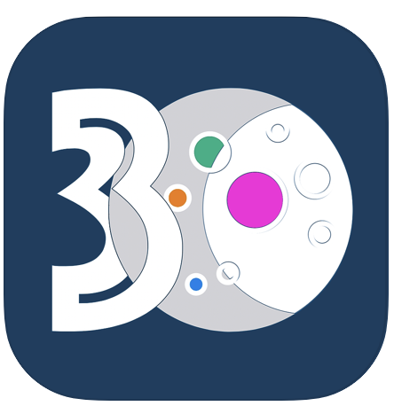

 A mobile app that allows users to create custom 30-day challenges either for themselves or a group while helping them stay accountable throughout the challenge.

## [Download on the iOS App Store](https://apps.apple.com/us/app/one-moon/id1502061901)

  

---

## Achieve your goals in 30 days.

- Create custom 30-day challenges
- Build a schedule for the challenge based on task types
- Choose from a collection of user-defined challenges
- Complete challenges in groups
- Join a community of supporters
- Stay accountable throughout the challenge with push notifications

## Built With

- [AWS Amplify](https://aws.amazon.com/amplify/) - Development Platform
- [React Native](https://reactnative.dev/) - Mobile Application Framework
- [Native Base](https://nativebase.io/) - UI Component Library for React Native
- [Zustand](https://github.com/react-spring/zustand) - State Management
- [GraphQL](https://graphql.org/) - Vector Graphics Editor

* [Visual Studio Code](https://code.visualstudio.com/) - Source-code Editor
* [Xcode](https://developer.apple.com/xcode/) - Integrated Development Environment for macOS
* [Sketch](https://www.sketch.com/) - Vector Graphics Editor

## Authors

_- **Miki Masumoto** - [GitHub](https://github.com/masumomo) - [LinkedIn](https://www.linkedin.com/in/miki-masumoto/)_

_- **Kota Aoyama** - [GitHub](https://github.com/KotaAoyama) - [LinkedIn](https://www.linkedin.com/in/kota-aoyama/)_

_- **Travis Ricks** - [GitHub](https://github.com/travisricks) - [LinkedIn](https://www.linkedin.com/in/travis-ricks/)_

_- **Nemanja Milenkovic** - [GitHub](https://github.com/NemanjaMilenkovic) - [LinkedIn](https://www.linkedin.com/in/NemanjaMilenkovic/)_

---

#### [Getting started for internal team members](GETTING_STARTED.md)

---

## Acknowledgments

Many thanks to the amazing Code Chrysalis staff - none of this would be possible without them. ❤️
